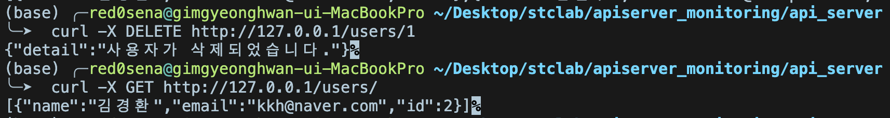

# API SERVER 코드와 설명


## 0. 개요

 FastAPI와 SQLAlchemy를 사용하여 사용자 관리 RESTful API를 구현하였으며, Prometheus를 통해 애플리케이션의 메트릭을 수집하고 있습니다.

## 1. 코드 구조

```python
api_server/
├── requirements.txt         
├── Dockerfile               
└── app/
    ├── main.py              
    ├── models.py            
    └── schemas.py          
```

## 2. 코드 구조 및 기능

### 2.1. 환경 설정 및 데이터베이스 연결

- **데이터베이스 URL 구성**: `os.environ.get()`을 통해 데이터베이스 연결에 필요한 정보를 환경 변수에서 가져옵니다. 그 후 PostgreSQL 데이터베이스에 연결할 수 있는 URL을 생성합니다.
- **SQLAlchemy 엔진 및 세션 설정**:
    - `engine`: `create_engine(DATABASE_URL)`을 통해 데이터베이스와의 연결을 관리합니다.
    - `SessionLocal`: `sessionmaker`를 사용하여 세션을 생성하고 관리합니다.

### 2.2. FastAPI 애플리케이션 설정

- **애플리케이션 인스턴스 생성**: `app = FastAPI()`를 통해 FastAPI 애플리케이션을 초기화합니다.
- **스타트업 이벤트**: `@app.on_event("startup")` 데코레이터를 사용하여 애플리케이션이 시작될 때 데이터베이스의 테이블을 생성합니다.

### 2.3. 데이터베이스 세션 관리

- **`get_db` 함수**: `yield`를 사용하여 데이터베이스 세션을 생성하고, 요청이 끝나면 세션을 종료합니다. 각 요청마다 세션이 독립적으로 관리됩니다.

### 2.4. Prometheus 메트릭 통합

- **메트릭 설정**:
    - `REQUEST_COUNT`: 총 요청 수를 카운트하는 `Counter` 메트릭입니다.
    - `REQUEST_LATENCY`: 요청 지연 시간을 측정하는 `Summary` 메트릭입니다.
- **미들웨어 설정**: `@app.middleware("http")`를 사용하여 모든 요청에 대해 메트릭을 수집하는 미들웨어를 설정합니다.
- **메트릭 엔드포인트**: `/metrics` 엔드포인트를 통해 Prometheus가 메트릭을 스크랩할 수 있도록 합니다.

### 2.5 Dockerfile로 이미지 생성 Docker hub에 업로드

- **Dockerfile:**
    - python 3.9-slim을 기반으로 합니다.
    - requirements.txt에 패키지들을 pip로 설치하였습니다.
    - Uvicorn ASGI 서버로 FastAPI 애플리케이션 실행, 모든 IP에서 접근 가능(0.0.0.0), 8000번 포트 사용합니다.
- **Docker hub에 업로드**
    - https://hub.docker.com/repository/docker/kyunghwankim/stclab/general

### 2.5. Health Check

- **`/health` 엔드포인트**: 애플리케이션의 상태를 확인하기 위한 헬스 체크 엔드포인트로, 단순히 `{"status": "OK"}`를 반환합니다.
    
    ```bash
    curl http://127.0.0.1/health
    ```
    
    
    

### 2.6. DB CRUD

- **사용자 생성 (`POST /users/`)**:
    
    ```bash
    curl -X POST http://127.0.0.1/users/ \
         -H "Content-Type: application/json" \
         -d '{"name": "홍길동", "email": "hong@example.com"}'
    ```
    
    
    
- **사용자 목록 조회 (`GET /users/`)**:
    
    ```bash
    curl -X GET http://127.0.0.1/users/
    ```
    
    
    
- **특정 사용자 조회 (`GET /users/{user_id}`)**:
    
    ```bash
    curl -X GET http://127.0.0.1/users/1
    ```
    
    
    
- **사용자 업데이트 (`PUT /users/{user_id}`)**:
    
    ```bash
    curl -X PUT http://127.0.0.1/users/1 \
         -H "Content-Type: application/json" \
         -d '{"name": "김철수", "email": "kim@example.com"}'
    ```
    
    
    
- **사용자 삭제 (`DELETE /users/{user_id}`)**:
    
    ```bash
    curl -X DELETE http://127.0.0.1/users/1
    ```
    
    